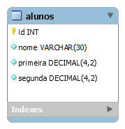

# Orientações gerais

## 1. SQL (Modelo Físico)

- No **phpMyAdmin** crie um banco de dados chamado `crud_escola_seunome`
- Dentro dele, crie uma tabela chamada **alunos** de acordo com a modelagem lógica indicada:

## 2. PHP e SQL        

- Programe os scripts **PHP** necessários para acessar o Banco de Dados usando **PDO**.
- Programe os scripts **PHP/SQL** necessários para realizar as operações **CRUD** para o aluno conforme as próximas orientações.

## 3. PHP

- Na página **inserir.php**, programe os recursos necessários para fazer `INSERT` no banco

- Na página **visualizar.php**, programe os recursos necessários para fazer `SELECT` no banco

*Obs.: antes de mostrar a Média e a Situação, elas devem ser determinados usando operações com **PHP** e/ou **SQL**. Média será a soma da primeira e da segunda nota e a divisão delas por 2. Situação será **aprovado** se média for maior ou igual a 7, **recuperação** se média maior ou igual a 5 e menor que 7, e **reprovado** caso média menor que 5.*

- Na página **atualizar.php**, programe os recursos necessários para fazer `SELECT` e `UPDATE` no banco

*Obs.: somente os campos `nome`, `primeira` e `segunda` poderão ser preenchidos manualmente. Média (readonly/disabled) será atualizada posteriormente de acordo com os valores dos campos das notas. E situação (readonly/disabled) será atualizada de acordo com o valor da média.*

- Na página **excluir.php**, programe os recursos necessários para fazer `DELETE` no banco

## DESAFIO 🔥

- Em **visualizar.php**, destaque pelo menos com cores diferentes para cada uma das situações (aprovado, reprovado e recuperação).
- Em **visualizar.php**, usando `JavaScript`, programe recursos que possibilitem que ao clicar em um link de exclusão, seja perguntado ao usuário se ele realmente deseja apagar aquele registro. Apenas se ele confirmar, a exclusão será feita.
- Se preferir, em vez de usar CSS puro, use recursos de formatação do Bootstrap.

## DESAFIO TURBINADO 🔥💥💯
- Em **atualizar.php**, usando `JavaScript`, programe recursos que permitam atualizar e exibir **em tempo real** os campos de `média` e `situação`. A ideia é que, no momento em que o usuário alterar as notas, ao mesmo tempo os campos `média` e `situação` mostrem os resultados de acordo com os novos valores.

